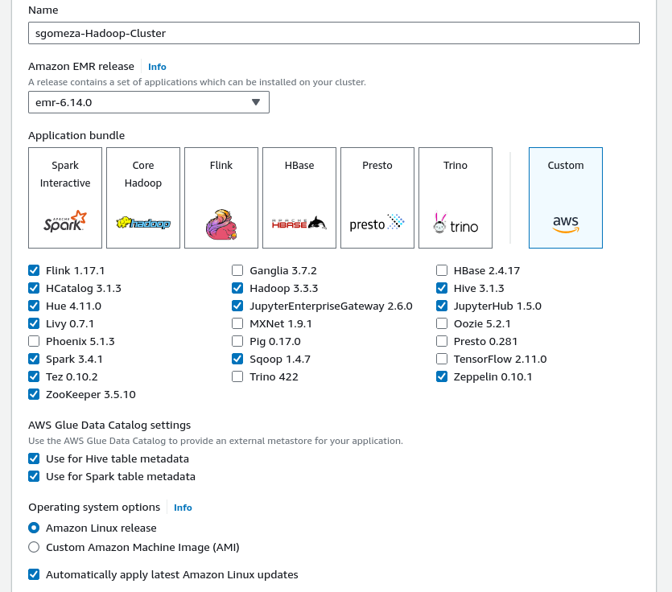
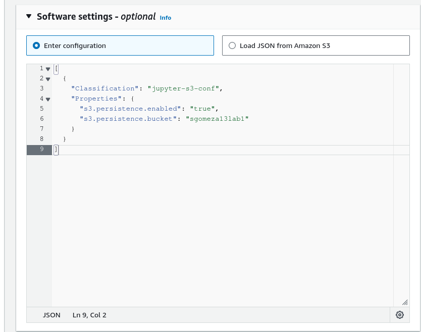
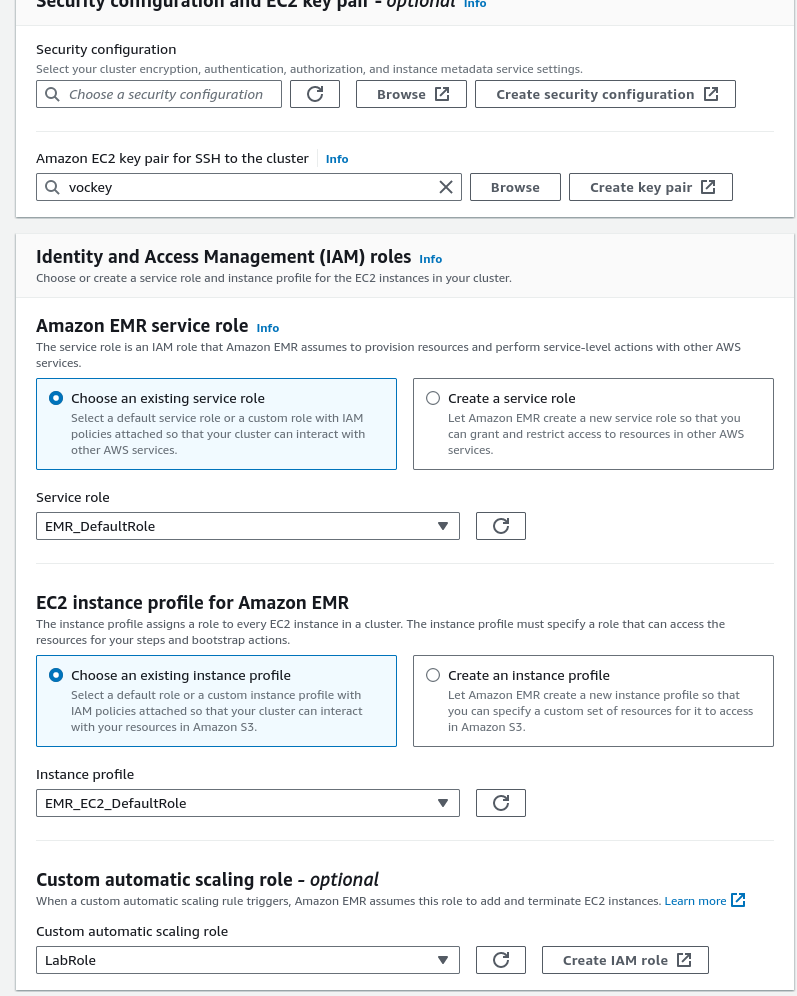
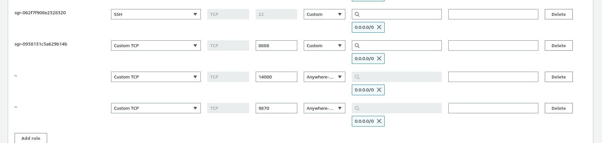
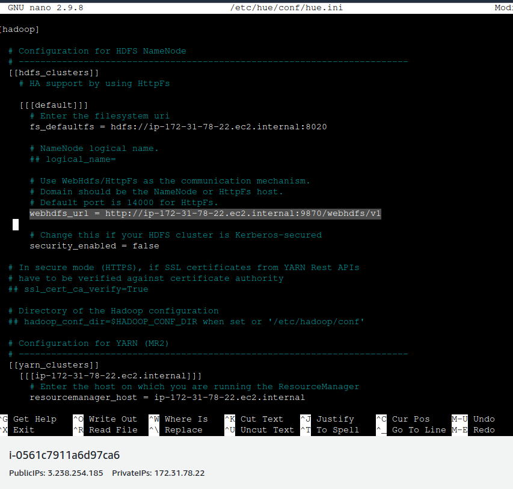
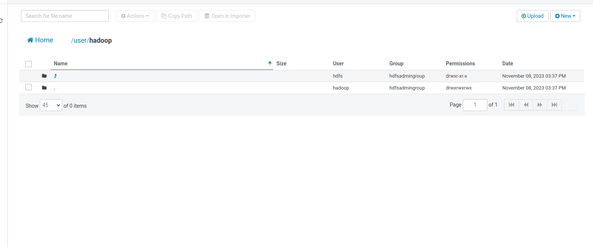
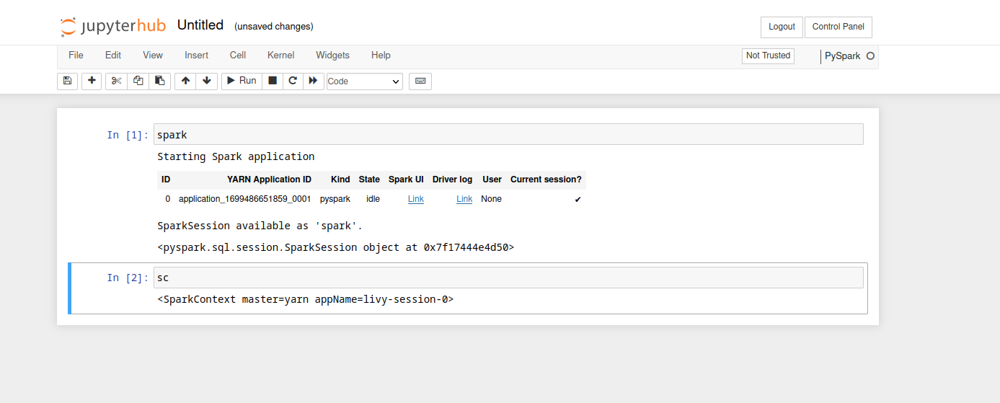

- [Laboratorio 0: Crear Cluster EMR](#laboratorio-0-crear-cluster-emr)
  - [Paso a paso:](#paso-a-paso)
  - [Resultados:](#resultados)


# Laboratorio 0: Crear Cluster EMR


## Paso a paso:

1.  Crear un cluster de Hadoop con las siguientes aplicaciones:
  

2. Agragar las siguientes software settings (el bucket de s3 sgomeza13lab1 con dicho nombre fue creado con anterioridad):


3. Agregar los roles y configuraciones de seguridad:
 

Una vez configurado todo esto se procede a crear el cluster.

4. Abrir los puertos 22, 14000 y 8890 del nodo master
 

5. cmabiar la configuracion de  /etc/hue/conf/hue.ini en el nodo master, remplazando webhdfs_url = http://ip-172-31-78-22.ec2.internal:14000/webhdfs/v1 por webhdfs_url = http://ip-172-31-78-22.ec2.internal:9870/webhdfs/v1
   

Y luego reiniciar el el servicio con
```
systemctl restart hue.service
```

## Resultados:

1. HUE por HDFS correctamente configurado
 
2. Jupyertlab corriendo correctamente
 