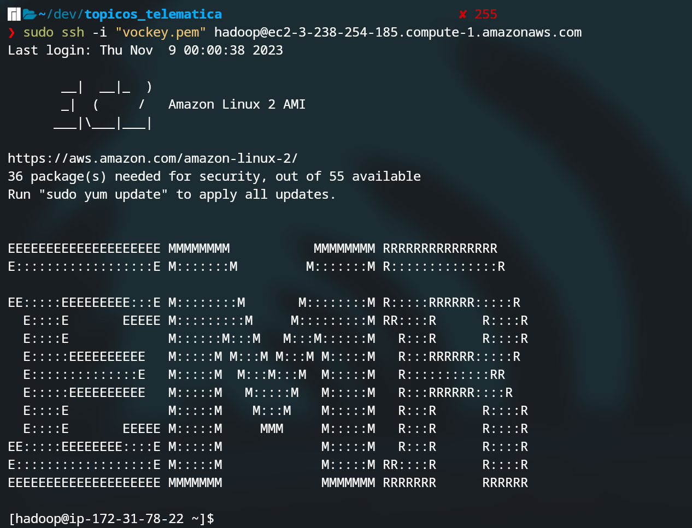
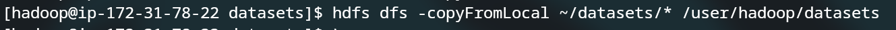
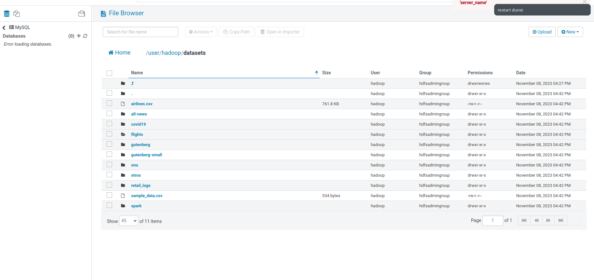
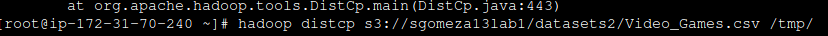
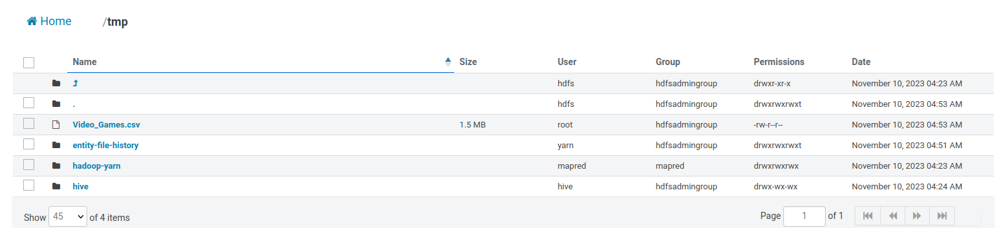
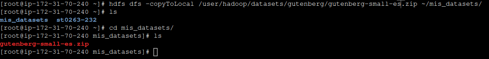
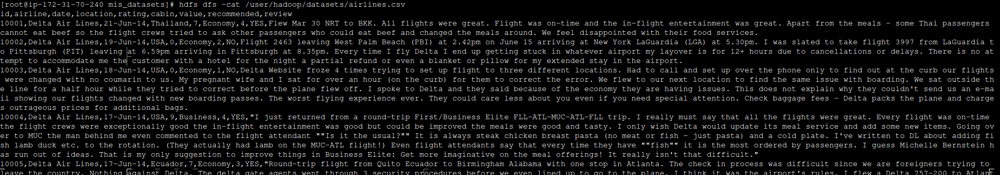
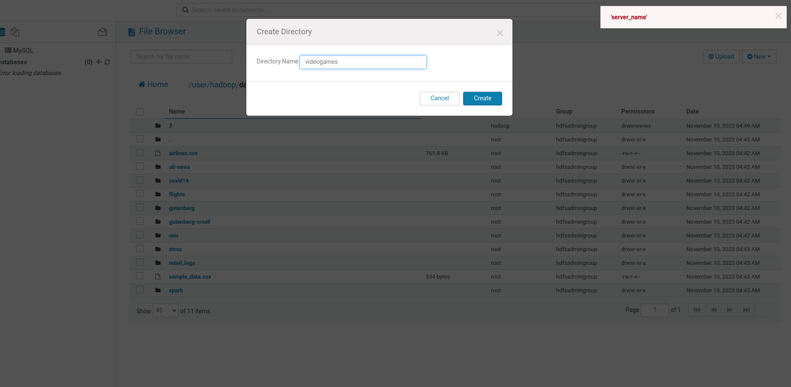
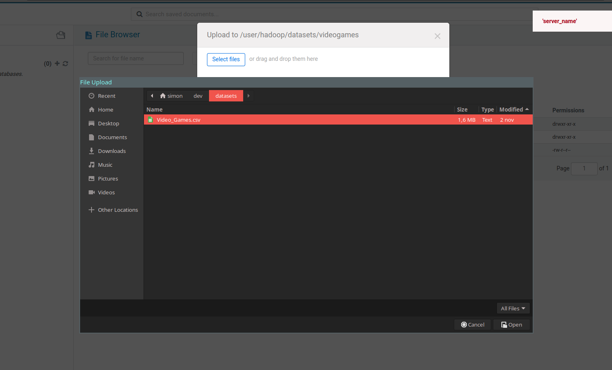
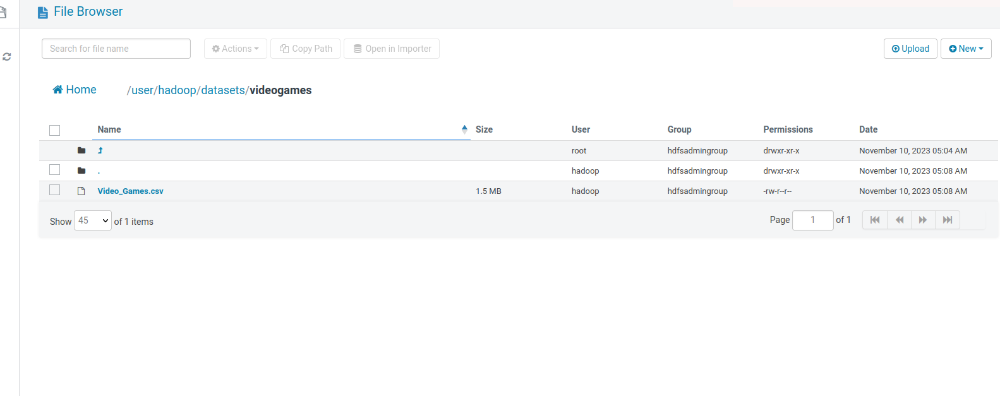

# Laboratorio 1: HDFS

- [Laboratorio 1: HDFS](#laboratorio-1-hdfs)
  - [Paso a paso:](#paso-a-paso)

## Paso a paso:

1. Conectarse al cluster ERM por ssh:
 

2. Instalar git (la vm no viene con el instalado)
   ```
   sudo yum update
    ```
    ```
    sudo yum install git
    ```
3. Crear la carpeta datasets dentro del user hadoop
    ```
    hdfs dfs -mkdir /user/hadoop/datasets
    ```
4. Clonar el repositorio:
   ```
   git clone https://github.com/st0263eafit/st0263-232.git
   ```
5. Copiar los archivos de st0263-232/bigdata/ a la carpeta datasets de hadoop:
    ```
     hdfs dfs -copyFromLocal st0263-232/bigdata/datasets/* /user/hadoop/datasets
    ```
    
    

    (tenia los archivos locales en la carpeta datasets)
    
Copiar archivos desde s3:



6. Copiar archivos al local: 
   

7. Probar otros comandos:
 

8. Subir archivos desde HUE Amazon EMR:






