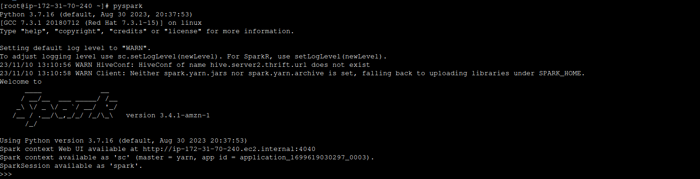
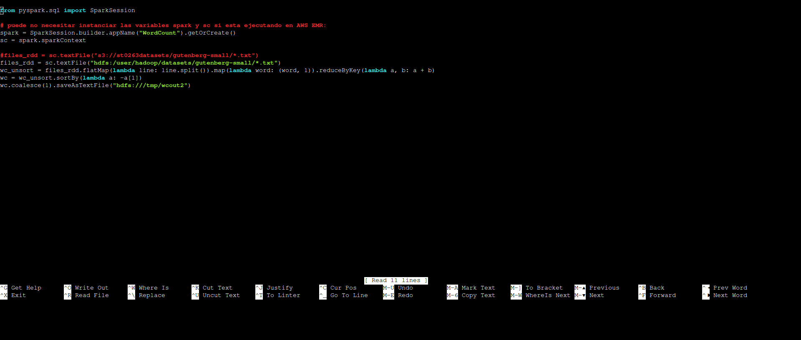
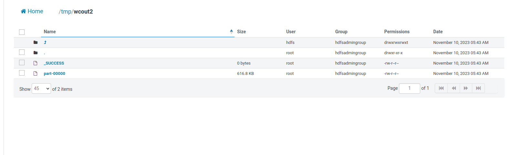
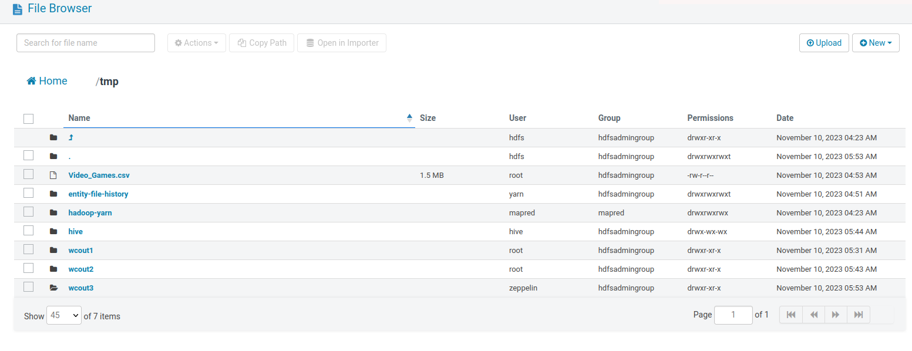

# Laboratorio 2: LAB SPARK

- [Laboratorio 2: LAB SPARK](#laboratorio-2-lab-spark)

1. Via pyspark en el nodo master: 
   
   
   

2. Via un archivo .py: 
   
   

3. En zeppelin:
   
   

4. Spark Jupyter-lab:

