# Laboratorio 4: Pyspark

1. Exploracion de datos
   1. importar datos y mostrar columnas:
 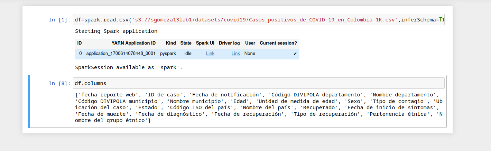

   2. Tipos de datos
   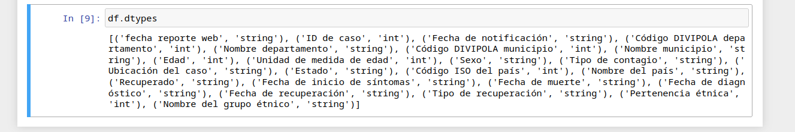 

   3. seleccionar algunas columnas
   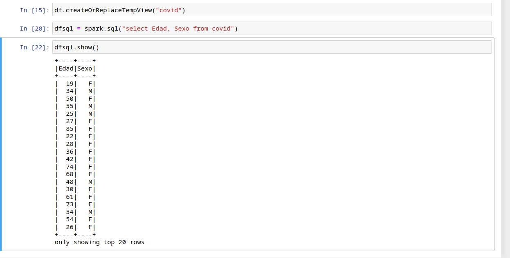

   4. RENOMBRAR COLUMNAS
   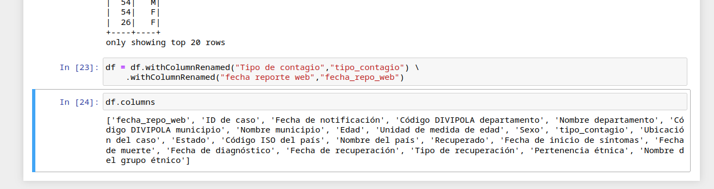
   
   5. agregar columnas
    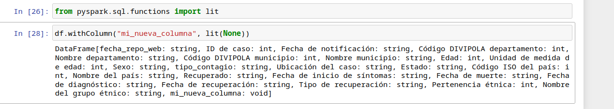
   
   6. borrar columnas
    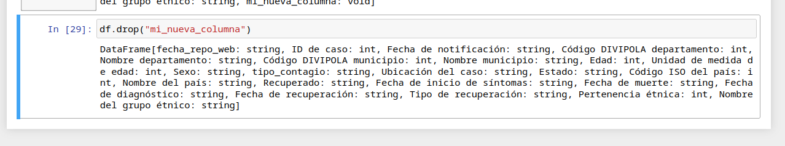 

    7. filtrar datos
    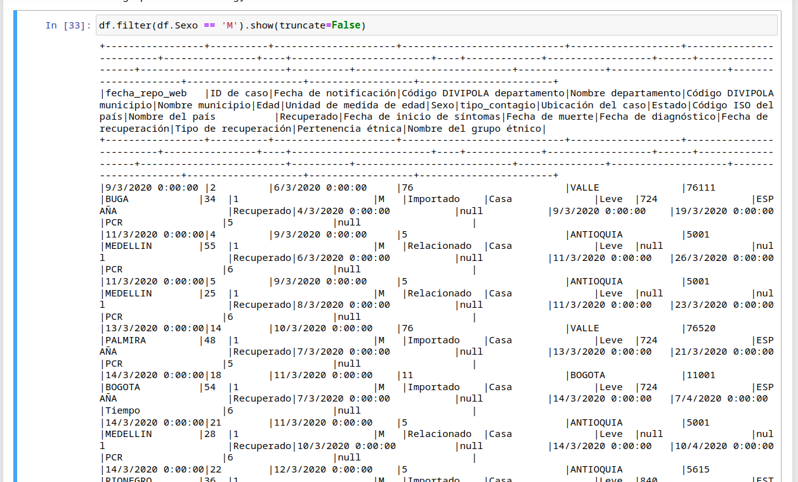  

    8. Utilizar UDF:
   Esta funcion toma todos los datos de la columna y convierte la primera letra de todos en mayuscula.
    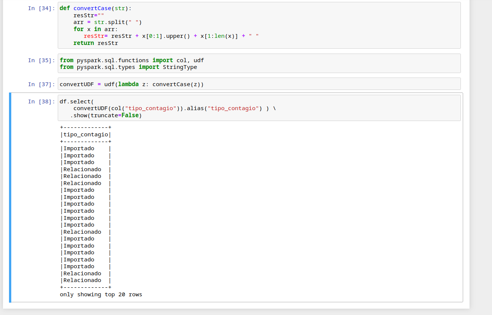

2. contestar las siguientes preguntas de negocio sobre los datos de covid:
   1. Los 10 departamentos con más casos de covid en Colombia ordenados de mayor a menor.
   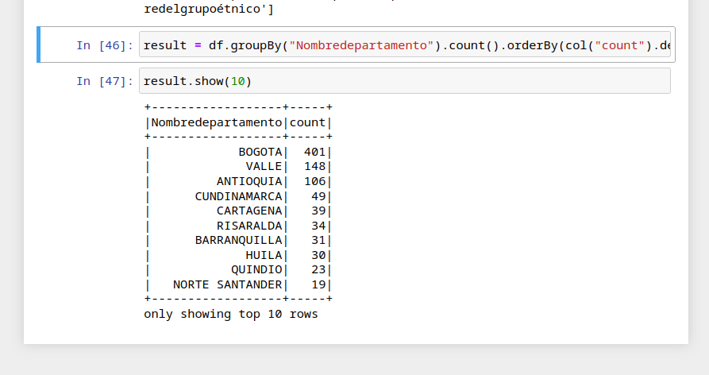
   2. Las 10 ciudades con más casos de covid en Colombia ordenados de mayor a menor.
   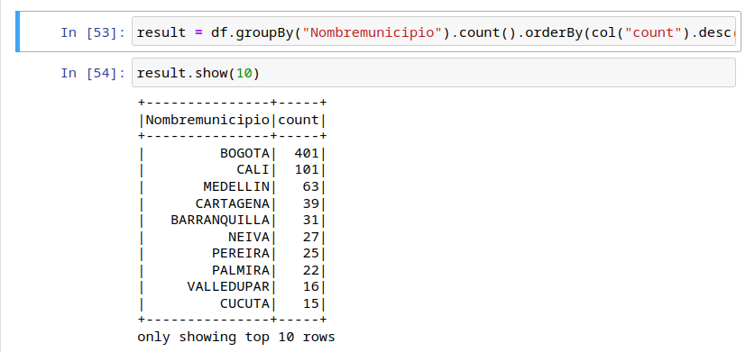
   3. Los 10 días con más casos de covid en Colombia ordenados de mayor a menor.
   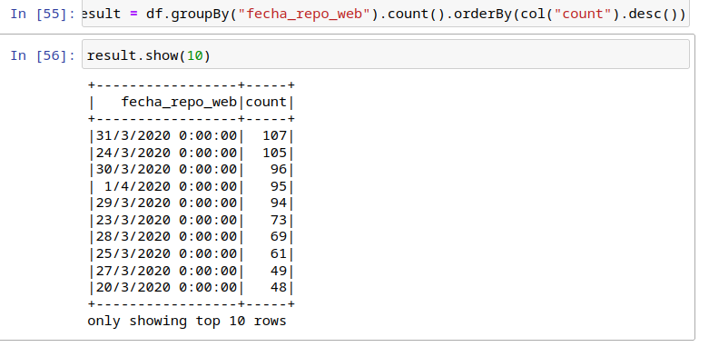
   4. Distribuciones de las edades
    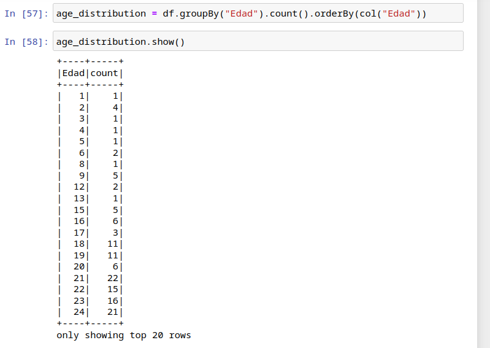
   5. Tasa de recuperacion
   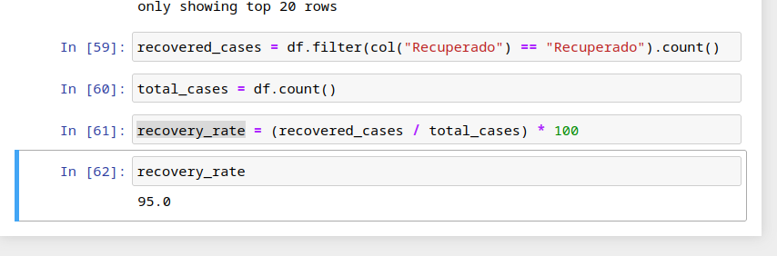 

3. Guardas los datos en s3:
   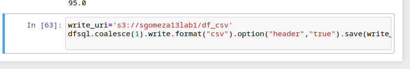
   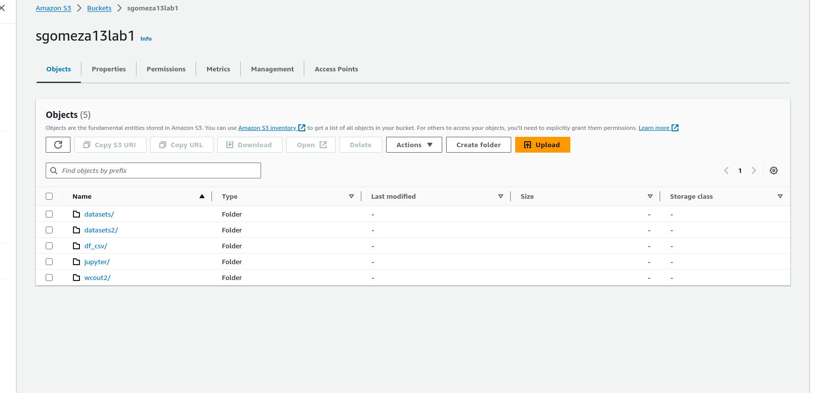
   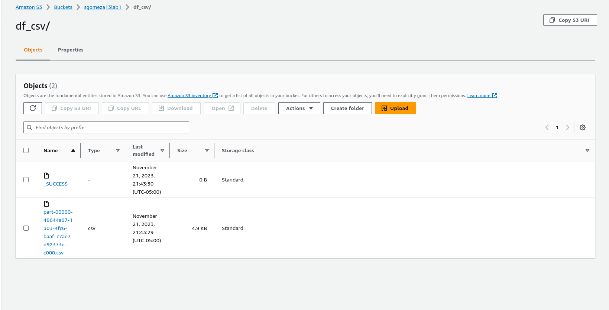